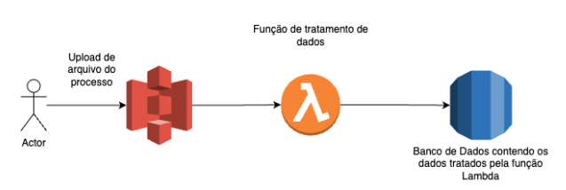

# Seções

- [Objetivo](#objetivo)
- [O que é criado pelo repositório](#o-que-é-criado-pelo-script)
- [Como correr o script](#como-correr-o-script)

# Objetivo

Criar uma aplicação simples que:

- Verifica a estrutura correta do CPF
- Valida os dados 
- Aponta onde está o possível erro no dado

O script deste projeto cria uma pipeline de análise e processamento de dados e armazena os dados em um repositório RDS para consulta.

# O que é criado pelo script

- Um Bucket S3;
- Uma Lambda Function com trigger de bucket S3;
- Um banco de dados RDS para armazenar os dados provenientes do arquivo que é adicionado ao bucket S3.

  

# Como executar o script

Dentro da pasta onde baixar os arquivos deste projeto, criar uma pasta chamada "Lambda" e baixar o pacote de instalação da biblioteca MySQL. Para isso, executar o comando via Terminal: 
  ```pip install --target /Lambda -r requirements.txt```

Existe na raiz do projeto um script chamado `main.tf`, basta acessar o diretorio via prompt e executar os comandos terraform:
  - terraform init
  - terraform plan
  - terraform apply

Para destruir toda a infraestrutura, basta executar `terraform destroy`
